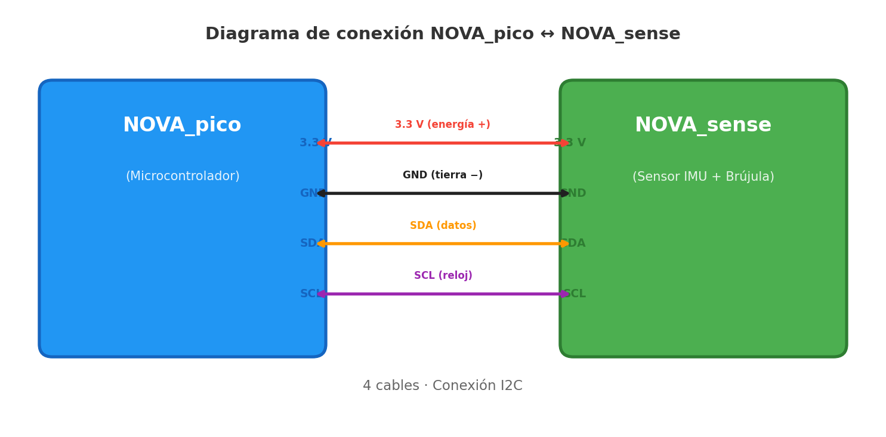

# Bienvenido a NOVA_sense

## ¿Qué es NOVA_sense?

NOVA_sense es una pequeña placa electrónica que le da **sentidos** a tus proyectos. Así como tú usas tus ojos para ver y tu oído interno para mantener el equilibrio, NOVA_sense le permite a un robot o cualquier dispositivo electrónico **saber hacia dónde apunta, detectar movimiento y encontrar el Norte**, todo desde una sola placa del tamaño de una moneda.

Piensa en ella como el **"cerebro sensorial"** de tu proyecto: tú le das las instrucciones, y ella te devuelve información sobre lo que está pasando en el mundo real.

## ¿A qué se parece? — Comparaciones sencillas

| Sensor en NOVA_sense | ¿A qué se parece en la vida real? | ¿Qué detecta? |
|---|---|---|
| **Magnetómetro** (LIS2MDL) | Una **brújula digital** como la de tu celular | Hacia dónde está el Norte magnético |
| **Acelerómetro** (dentro del LSM6DS3) | El sensor que **gira la pantalla** de tu celular cuando lo inclinas | Inclinación, vibración, caídas |
| **Giroscopio** (dentro del LSM6DS3) | El sensor que detecta **giros** cuando juegas un videojuego moviendo el celular | Velocidad y dirección de rotación |

> **En resumen:** tu celular usa sensores muy parecidos a los de NOVA_sense para rotar la pantalla, orientar mapas y detectar movimiento. NOVA_sense te da esos mismos poderes para tus propios inventos.

## ¿Qué puedes hacer con ella?

- **Construir un robot que sepa hacia dónde va** — como un auto a control remoto que siempre sabe dónde está el Norte.
- **Detectar movimiento y gestos** — inclinar, agitar, girar: ideal para controles de juegos o instrumentos interactivos.
- **Crear una brújula electrónica** — muestra en una pantalla hacia dónde apuntas, igual que la app de brújula de un teléfono.
- **Registrar datos de movimiento** — grabar cómo se mueve un objeto (por ejemplo, una bicicleta o un dron) y analizarlo después.
- **Detectar la presencia de imanes o metales cercanos** — gracias a la sensibilidad del magnetómetro.
- **Estabilizar mecanismos** — como un dron que se auto-nivela o una cámara que compensa los temblores de la mano.

## Antes de empezar

> **Este manual está escrito en un lenguaje sencillo** para que cualquier persona, sin importar su experiencia, pueda seguir los pasos y lograr resultados. Sigue los ejemplos en orden, prueba cada uno y, si algo no funciona, revisa las conexiones antes de continuar.

# 1 Conoce tu NOVA_sense

### 1.1 Descripción general

En esta página se muestran los componentes principales del módulo NOVA_sense con su nombre común y una breve descripción para facilitar su identificación.

### 1.2 Componentes (nombre común — descripción)

- **IMU (LSM6DS3)** — Acelerómetro y giroscopio integrados (6 ejes). Mide aceleración lineal y velocidad angular para detección de movimiento y fusión inercial.

- **Magnetómetro (LIS2MDL)** — Sensor de campo magnético 3 ejes utilizado como brújula electrónica para orientación respecto al Norte magnético.

- **Conectores 4 pines (CN1, CN2)** — Conectores SMD para alimentación y señales (paso 1.0 mm) usados para integrar el módulo en placas madre o accesorios.

- **Condensadores 100 nF / 220 nF / 4.7 µF** — Filtrado y estabilización de la alimentación.

- **Resistencias 10 kΩ** — Pull-ups/pull-downs para asegurar niveles lógicos estables en líneas digitales.

\begin{center}
\includegraphics[width=0.45\textwidth]{componentes NOVA_sense.png}
\end{center}

### 1.3 Resumen funcional

Todos estos componentes trabajan juntos para proporcionar el soporte necesario para integrarse fácilmente en proyectos de robótica, navegación y registradores de datos.

# 2 Hardware y Conexiones

Conectar la NOVA_sense es tan sencillo como conectar unos audífonos: solo necesitas **4 cables** entre tu **NOVA_pico** y la NOVA_sense. La NOVA_pico es un microcontrolador que también fabricamos nosotros, diseñado para trabajar en conjunto con la NOVA_sense. Este tipo de conexión se llama **I2C** (se pronuncia "ai-dos-cé") y es un estándar muy común en electrónica.

### 2.1 ¿Qué cables necesito?

| Cable | Nombre | ¿Qué hace? | Analogía |
|---|---|---|---|
| 1 | **3.3 V** | Alimenta la NOVA_sense con corriente | El polo **+** de una pila |
| 2 | **GND** | Cierra el circuito (tierra) | El polo **−** de una pila |
| 3 | **SDA** | Envía y recibe datos | El "hilo" por donde se mandan mensajes |
| 4 | **SCL** | Marca el ritmo de la comunicación | El "reloj" que sincroniza la conversación |

### 2.2 Paso a paso para conectar



1. Conecta **3.3 V** de tu **NOVA_pico** al pin **3.3 V** de la NOVA_sense.
2. Conecta **GND** de tu **NOVA_pico** al pin **GND** de la NOVA_sense.
3. Conecta **SDA** de tu **NOVA_pico** al pin **SDA** de la NOVA_sense.
4. Conecta **SCL** de tu **NOVA_pico** al pin **SCL** de la NOVA_sense.

> **Importante:** Nunca conectes 5 V a los pines de la NOVA_sense — solo usa 3.3 V.

\newpage

**Consejos:**

- Asegúrate de que ambas placas compartan el mismo **GND**.
- Si ya tienes otros sensores I2C conectados, la NOVA_sense puede compartir los mismos cables SDA y SCL — como enchufar varios aparatos a la misma regleta.
- Muchas placas ya incluyen resistencias pull-up; si la tuya no las tiene, añade una de 4.7 kΩ en SDA y otra en SCL.

### 2.3 Entorno de programación: Thonny

Para programar la NOVA_pico y leer los datos de la NOVA_sense se utiliza **Thonny**, el único entorno compatible con estas placas.

> **¿Qué es Thonny?** Es un programa gratuito y sencillo que se instala en tu computadora. Desde ahí puedes escribir código en MicroPython, enviarlo a la NOVA_pico por USB y ver en tiempo real los datos que lee la NOVA_sense (orientación, movimiento, campo magnético).
>
> **Descárgalo aquí:** \textcolor{blue}{\underline{\href{https://thonny.org}{https://thonny.org}}} — disponible para Windows, Mac y Linux.

### 2.4 Leer registros y memoria del sensor (explicación simple)

Lo habitual es leer registros del sensor por I2C: cada sensor tiene direcciones de registro (por ejemplo `WHO_AM_I`) que te permiten comprobar que el chip responde. Para obtener datos, lees los registros de salida y conviertes los bytes en valores utilizables (ver sección de programación).

Para acceder a los archivos o programas guardados en la NOVA_pico, se utiliza exclusivamente **Thonny**, el entorno de programación oficial para estas placas. Desde **Thonny** puedes escribir código, subirlo a la NOVA_pico y ver los datos que lee la NOVA_sense — todo desde una sola ventana. No se modifica la memoria del sensor directamente; en su lugar se leen registros vía I2C.

### 2.5 La NOVA_pico como controlador

La `NOVA_pico` es una placa compatible con RP2 que puede ejecutar MicroPython.

**Cómo usar ambas juntas (resumen):**

- Conecta `3V3` <-> `3V3` y `GND` <-> `GND` entre `NOVA_pico` y `NOVA_sense`.
- Conecta `SDA` y `SCL` de la `NOVA_pico` a `SDA` y `SCL` de la `NOVA_sense`.
- Instala MicroPython en la `NOVA_pico` y abre Thonny.
- Desde Thonny puedes escribir scripts que usen la clase `I2C` para leer registros del sensor y guardar lecturas en archivos en la memoria de la `NOVA_pico` (por ejemplo `data.csv`). Thonny permite ver y descargar esos archivos fácilmente.

**Resumen práctico:** la `NOVA_pico` actúa como «cerebro» que habla con la `NOVA_sense` por I2C y almacena o envía los datos a tu computador para su análisis. Aquí nos centramos en cómo conectar físicamente y en las ideas generales para leer datos.

# 3 Programación con MicroPython

### 3.1 Herramientas recomendadas

- `Thonny`: recomendado para empezar con MicroPython; muestra la consola REPL y permite editar/guardar archivos en la placa fácilmente.

### 3.2 Ver las lecturas en Thonny

1. Conecta la `NOVA_pico` por USB y abre Thonny.
2. Selecciona el intérprete MicroPython correspondiente a tu placa.
3. Abre la consola REPL (panel inferior): al ejecutar `print()` verás la salida inmediatamente en esa consola; es útil para depurar lecturas del sensor.

### 3.3 Ejemplos básicos en MicroPython (en Thonny)

Nota: los ejemplos usan la clase `I2C` de MicroPython. Ajusta los pines `scl` y `sda` según tu placa (en la `NOVA_pico` suelen ser los pines I2C por defecto).

**Ejemplo A — Escanear el bus I2C y leer registro WHO_AM_I (identidad)**

```python
from machine import I2C, Pin
import time

# Ajusta los pines según tu placa
i2c = I2C(0, scl=Pin(21), sda=Pin(20))

print('Escaneando I2C...')
devices = i2c.scan()
print('Dispositivos I2C encontrados:', devices)

# Registro de identidad (WHO_AM_I) indicado para este sensor
WHO_REG = 0x4F

for dev in devices:
    try:
        who = i2c.readfrom_mem(dev, WHO_REG, 1)
        print('Dispositivo', hex(dev), 'WHO_AM_I =', who[0])
    except Exception:
        # no todos los dispositivos responden a ese registro
        pass

time.sleep(1)
```

En la consola de Thonny verás la lista de direcciones I2C detectadas y, si alguno responde al registro `WHO_AM_I`, su valor.

**Ejemplo B — Leer datos crudos del acelerómetro (lectura genérica)**

```python
from machine import I2C, Pin
import struct

i2c = I2C(0, scl=Pin(21), sda=Pin(20))

# Reemplaza DEVICE_ADDR por la dirección que encontró tu escaneo
DEVICE_ADDR = 0x6A  # ejemplo, puede variar
OUTX_L = 0x28       # registro inicial de datos (ejemplo común)

def read_accel(addr):
    raw = i2c.readfrom_mem(addr, OUTX_L, 6)
    # convertir 6 bytes en tres valores signed 16-bit (little endian)
    x = struct.unpack('<h', raw[0:2])[0]
    y = struct.unpack('<h', raw[2:4])[0]
    z = struct.unpack('<h', raw[4:6])[0]
    # la escala depende del sensor; aquí mostramos los crudos
    return x, y, z

try:
    x, y, z = read_accel(DEVICE_ADDR)
    print('Acelerómetro raw:', x, y, z)
except Exception as e:
    print('Error:', e)
```

Explicación sencilla: los valores crudos son enteros que cambian si mueves el sensor. En Thonny verás los `print()` aparecer en la consola.

### 3.4 Guardar lecturas en un archivo desde Thonny

Puedes guardar lecturas en la memoria de la `NOVA_pico` para analizarlas luego:

```python
import time

with open('data.csv', 'w') as f:
    f.write('t,x,y,z\n')
    for t in range(100):
        x, y, z = read_accel(DEVICE_ADDR)
        f.write(f"{t},{x},{y},{z}\n")
        time.sleep(0.1)
```

**Consejos de depuración:**

- Usa `print()` para depurar en la consola de Thonny.
- Si obtienes errores de lectura, revisa que `GND` esté conectado correctamente y que la alimentación sea 3.3 V.

# 4 Seguridad y buenas prácticas

Antes de trabajar con la NOVA_sense, ten en cuenta estas recomendaciones para evitar daños al hardware y asegurar lecturas fiables:

- **Alimentación correcta**: usa 3.3 V en los pines de señal y alimentación. No conectes 5 V a los pines I2C o de señal.

- **GND común**: siempre conecta la masa (`GND`) entre la NOVA_pico (o microcontrolador) y la NOVA_sense antes de alimentar el sistema.

- **Conexiones firmes**: evita cables sueltos; utiliza conectores o headers bien soldados para prevenir desconexiones durante pruebas.

- **Evita campos magnéticos fuertes**: el magnetómetro (LIS2MDL) se altera con imanes o corrientes cercanas — mantén alejada la NOVA_sense de fuentes magnéticas potentes durante calibración y mediciones.

- **Calibración y pruebas iniciales**: realiza un `i2c.scan()` y verifica el `WHO_AM_I` antes de usar los datos; calibra la brújula si vas a usar orientación absoluta.

- **Protección ESD**: manipula la placa en una superficie antiestática o descarga tu energía con una pulsera ESD si trabajas en un entorno sensible.

- **Documenta cambios**: si modificas hardware (jumpers, resistencias), anota los cambios para reproducir pruebas y diagnóstico.
- **Sin garantía por daño físico**: si la placa se quema por una conexión incorrecta o sobrevoltaje, no tiene garantía. Tendrás que reemplazarla por una nueva.

# 5 Computación Física con NOVA_sense

La NOVA_sense es una placa sensorial que integra tres sensores capaces de medir magnitudes físicas del mundo real: **aceleración**, **velocidad angular** (giros) y **campo magnético**. En esta sección aprenderás a leer cada uno de ellos, interpretar sus datos y usarlos en proyectos de computación física.

> **Recuerda:** la NOVA_sense no se programa directamente — se conecta por I2C a un microcontrolador (como la NOVA_pico, un Arduino o un ESP32) que lee sus registros y ejecuta tu código.

### 5.1 Los sensores de la NOVA_sense

La NOVA_sense contiene dos chips que proporcionan tres tipos de medición:

| Chip | Sensor | ¿Qué mide? | Dirección I2C |
|---|---|---|---|
| **LSM6DS3** | Acelerómetro | Aceleración lineal en 3 ejes (X, Y, Z) | `0x6A` |
| **LSM6DS3** | Giroscopio | Velocidad de rotación en 3 ejes | `0x6A` |
| **LIS2MDL** | Magnetómetro | Campo magnético en 3 ejes (brújula) | `0x1E` |

Ambos chips se comunican por **I2C**, así que solo necesitas 4 cables (3V3, GND, SDA, SCL) para acceder a toda la información.

### 5.2 Verificar que la NOVA_sense responde

Antes de leer datos, confirma que tu microcontrolador detecta la NOVA_sense en el bus I2C:

```python
from machine import I2C, Pin

i2c = I2C(0, scl=Pin(21), sda=Pin(20))

print("Dispositivos I2C encontrados:")
for addr in i2c.scan():
    print(f"  -> 0x{addr:02X}", end="")
    if addr == 0x6A:
        print("  (LSM6DS3 - acelerómetro/giroscopio)")
    elif addr == 0x1E:
        print("  (LIS2MDL - magnetómetro)")
    else:
        print()
```

**Resultado esperado:**

```
Dispositivos I2C encontrados:
  -> 0x1E  (LIS2MDL - magnetómetro)
  -> 0x6A  (LSM6DS3 - acelerómetro/giroscopio)
```

Si no aparecen, revisa las conexiones SDA, SCL, 3V3 y GND.

### 5.3 Leer el acelerómetro (LSM6DS3)

El acelerómetro mide la **aceleración** en tres ejes. Cuando la placa está quieta sobre una mesa, el eje Z marca aproximadamente **1g** (9.8 m/s²) por la gravedad terrestre.

**Configuración e inicialización:**

```python
from machine import I2C, Pin
import struct
import time

i2c = I2C(0, scl=Pin(21), sda=Pin(20))

LSM6DS3_ADDR = 0x6A

# Registro WHO_AM_I para verificar identidad
who = i2c.readfrom_mem(LSM6DS3_ADDR, 0x0F, 1)[0]
print(f"LSM6DS3 WHO_AM_I: 0x{who:02X}")  # debe ser 0x69

# Activar acelerómetro: 104 Hz, +/- 2g
i2c.writeto_mem(LSM6DS3_ADDR, 0x10, bytes([0x40]))
```

**Lectura continua del acelerómetro:**

```python
def leer_acelerometro():
    raw = i2c.readfrom_mem(LSM6DS3_ADDR, 0x28, 6)
    ax = struct.unpack('<h', raw[0:2])[0]
    ay = struct.unpack('<h', raw[2:4])[0]
    az = struct.unpack('<h', raw[4:6])[0]
    # Convertir a g (escala +/- 2g: 0.061 mg/LSB)
    return ax * 0.000061, ay * 0.000061, az * 0.000061

while True:
    x, y, z = leer_acelerometro()
    print(f"Acel:  X={x:+.3f}g  Y={y:+.3f}g  Z={z:+.3f}g")
    time.sleep(0.3)
```

**Resultado esperado (placa horizontal sobre una mesa):**

```
Acel:  X=+0.012g  Y=-0.008g  Z=+0.998g
Acel:  X=+0.015g  Y=-0.005g  Z=+1.001g
```

> **Interpretación:** X y Y cercanos a 0  indica que la placa está nivelada. Z cercano a 1g  confirma que la gravedad actúa sobre ese eje. Al inclinar la placa, los valores de X e Y cambian.

### 5.4 Leer el giroscopio (LSM6DS3)

El giroscopio mide la **velocidad de rotación** (en grados por segundo, °/s). Cuando la placa está quieta, los tres ejes deben marcar valores cercanos a cero.

```python
# Activar giroscopio: 104 Hz, 245 °/s
i2c.writeto_mem(LSM6DS3_ADDR, 0x11, bytes([0x40]))

def leer_giroscopio():
    raw = i2c.readfrom_mem(LSM6DS3_ADDR, 0x22, 6)
    gx = struct.unpack('<h', raw[0:2])[0]
    gy = struct.unpack('<h', raw[2:4])[0]
    gz = struct.unpack('<h', raw[4:6])[0]
    # Convertir a °/s (escala 245 °/s: 8.75 mdps/LSB)
    return gx * 0.00875, gy * 0.00875, gz * 0.00875

while True:
    x, y, z = leer_giroscopio()
    print(f"Giro:  X={x:+.2f} °/s  Y={y:+.2f} °/s  Z={z:+.2f} °/s")
    time.sleep(0.3)
```

**Resultado esperado (placa quieta):**

```
Giro:  X=+0.18 °/s  Y=-0.09 °/s  Z=+0.04 °/s
```

> Al girar la placa sobre la mesa (como una brújula), el eje Z muestra la velocidad de ese giro. Inclinarla hacia adelante afecta al eje X, y hacia un lado al eje Y.

### 5.5 Leer el magnetómetro / brújula (LIS2MDL)

El magnetómetro mide el **campo magnético** terrestre en tres ejes, lo que permite construir una **brújula digital** que indica el Norte.

```python
LIS2MDL_ADDR = 0x1E

# Verificar identidad
who = i2c.readfrom_mem(LIS2MDL_ADDR, 0x4F, 1)[0]
print(f"LIS2MDL WHO_AM_I: 0x{who:02X}")  # debe ser 0x40

# Activar: modo continuo, 50 Hz
i2c.writeto_mem(LIS2MDL_ADDR, 0x60, bytes([0x00]))

import math

def leer_magnetometro():
    raw = i2c.readfrom_mem(LIS2MDL_ADDR, 0x68, 6)
    mx = struct.unpack('<h', raw[0:2])[0]
    my = struct.unpack('<h', raw[2:4])[0]
    mz = struct.unpack('<h', raw[4:6])[0]
    # Convertir a microteslas (1.5 mgauss/LSB = 0.15 uT/LSB)
    return mx * 0.15, my * 0.15, mz * 0.15

def calcular_rumbo(mx, my):
    angulo = math.atan2(my, mx) * 180 / math.pi
    if angulo < 0:
        angulo += 360
    return angulo

while True:
    mx, my, mz = leer_magnetometro()
    rumbo = calcular_rumbo(mx, my)
    print(f"Mag: X={mx:+.1f} uT  Y={my:+.1f} uT  Z={mz:+.1f} uT  | Rumbo: {rumbo:.0f}°")
    time.sleep(0.5)
```

**Resultado esperado:**

```
Mag: X=+20.3 uT  Y=-15.7 uT  Z=+42.1 uT  | Rumbo: 322°
Mag: X=+25.1 uT  Y=+3.2 uT   Z=+41.8 uT  | Rumbo:  7°
```

> El rumbo 0° = Norte, 90° = Este, 180° = Sur, 270° = Oeste. Gira la NOVA_sense horizontalmente y verás cómo cambia el ángulo.

### 5.6 Detectar inclinación con el acelerómetro

El acelerómetro puede calcular el **ángulo de inclinación** de la NOVA_sense respecto a la horizontal, usando la componente de gravedad en cada eje:

```python
import math

def calcular_inclinacion(ax, ay, az):
    # Ángulo en grados respecto a horizontal
    pitch = math.atan2(ax, math.sqrt(ay**2 + az**2)) * 180 / math.pi
    roll  = math.atan2(ay, math.sqrt(ax**2 + az**2)) * 180 / math.pi
    return pitch, roll

while True:
    ax, ay, az = leer_acelerometro()
    pitch, roll = calcular_inclinacion(ax, ay, az)
    print(f"Pitch: {pitch:+.1f}°  Roll: {roll:+.1f}°")
    time.sleep(0.3)
```

**Resultado esperado (placa horizontal):**

```
Pitch: +0.7°  Roll: -0.5°
```

Al inclinar la NOVA_sense hacia adelante, el pitch aumenta. Al inclinarla de lado, el roll cambia. Esto sirve para **nivelar plataformas**, **controlar movimiento** o **detectar caídas**.

### 5.7 Detectar movimiento y golpes

El acelerómetro puede detectar si la NOVA_sense **se está moviendo, agitando o recibiendo un golpe**:

```python
UMBRAL_MOVIMIENTO = 0.15  # en g (ajustar según necesidad)
UMBRAL_GOLPE = 2.0        # en g

while True:
    ax, ay, az = leer_acelerometro()

    # Magnitud total de aceleración
    magnitud = math.sqrt(ax**2 + ay**2 + az**2)

    # Restar gravedad (1g) para ver solo el movimiento
    movimiento = abs(magnitud - 1.0)

    if movimiento > UMBRAL_GOLPE:
        print(f"*** GOLPE detectado: {magnitud:.2f}g ***")
    elif movimiento > UMBRAL_MOVIMIENTO:
        print(f"Movimiento: {movimiento:.3f}g")
    else:
        print("Quieto")

    time.sleep(0.1)
```

> **Aplicaciones:** alarma antirrobo (detectar que alguien mueve un objeto), podómetro (contar pasos), o protección de equipos frágiles.

### 5.8 Ejemplo completo: leer los 9 ejes de la NOVA_sense

Este script lee simultáneamente los tres sensores (acelerómetro + giroscopio + magnetómetro = 9 ejes) y muestra todo en la consola:

```python
from machine import I2C, Pin
import struct
import math
import time

i2c = I2C(0, scl=Pin(21), sda=Pin(20))

LSM6DS3 = 0x6A
LIS2MDL = 0x1E

# Inicializar LSM6DS3 (accel 104Hz +/-2g, gyro 104Hz 245°/s)
i2c.writeto_mem(LSM6DS3, 0x10, bytes([0x40]))
i2c.writeto_mem(LSM6DS3, 0x11, bytes([0x40]))

# Inicializar LIS2MDL (modo continuo)
i2c.writeto_mem(LIS2MDL, 0x60, bytes([0x00]))

time.sleep(0.1)

def leer_9_ejes():
    # Acelerómetro
    raw_a = i2c.readfrom_mem(LSM6DS3, 0x28, 6)
    ax = struct.unpack('<h', raw_a[0:2])[0] * 0.000061
    ay = struct.unpack('<h', raw_a[2:4])[0] * 0.000061
    az = struct.unpack('<h', raw_a[4:6])[0] * 0.000061

    # Giroscopio
    raw_g = i2c.readfrom_mem(LSM6DS3, 0x22, 6)
    gx = struct.unpack('<h', raw_g[0:2])[0] * 0.00875
    gy = struct.unpack('<h', raw_g[2:4])[0] * 0.00875
    gz = struct.unpack('<h', raw_g[4:6])[0] * 0.00875

    # Magnetómetro
    raw_m = i2c.readfrom_mem(LIS2MDL, 0x68, 6)
    mx = struct.unpack('<h', raw_m[0:2])[0] * 0.15
    my = struct.unpack('<h', raw_m[2:4])[0] * 0.15
    mz = struct.unpack('<h', raw_m[4:6])[0] * 0.15

    return ax, ay, az, gx, gy, gz, mx, my, mz

print("=== NOVA_sense - Lectura de 9 ejes ===")
print("Acel (g)          | Giro (°/s)          | Mag (uT)")
print("-" * 60)

while True:
    ax, ay, az, gx, gy, gz, mx, my, mz = leer_9_ejes()
    rumbo = (math.atan2(my, mx) * 180 / math.pi) % 360

    print(f"{ax:+.3f} {ay:+.3f} {az:+.3f} | "
          f"{gx:+6.1f} {gy:+6.1f} {gz:+6.1f} | "
          f"{mx:+6.0f} {my:+6.0f} {mz:+6.0f}  N:{rumbo:.0f}°")
    time.sleep(0.5)
```

### 5.9 Guardar lecturas de la NOVA_sense en un archivo CSV

Para registrar datos de movimiento y analizarlos después en una hoja de cálculo:

```python
MUESTRAS = 500
INTERVALO = 0.05  # 50 ms = 20 muestras/segundo

with open('nova_sense_log.csv', 'w') as f:
    f.write('t,ax,ay,az,gx,gy,gz,mx,my,mz\n')
    for t in range(MUESTRAS):
        ax, ay, az, gx, gy, gz, mx, my, mz = leer_9_ejes()
        f.write(f'{t*INTERVALO:.3f},{ax:.4f},{ay:.4f},{az:.4f},'
                f'{gx:.2f},{gy:.2f},{gz:.2f},'
                f'{mx:.1f},{my:.1f},{mz:.1f}\n')
        time.sleep(INTERVALO)

print(f'Listo: {MUESTRAS} muestras guardadas en nova_sense_log.csv')
print('Descárgalo desde Thonny: panel de archivos -> clic derecho -> Descargar')
```

### 5.10 Calibración del magnetómetro

Para obtener lecturas de brújula precisas, el magnetómetro necesita **calibración**. Objetos metálicos o corrientes cercanas distorsionan las lecturas (esto se llama *hard iron offset*). El procedimiento es sencillo:

```python
print("Gira la NOVA_sense lentamente en todas las direcciones...")
print("Presiona Ctrl+C cuando hayas completado varias rotaciones.\n")

min_x, max_x = 99999, -99999
min_y, max_y = 99999, -99999

try:
    while True:
        mx, my, mz = leer_magnetometro()
        if mx < min_x: min_x = mx
        if mx > max_x: max_x = mx
        if my < min_y: min_y = my
        if my > max_y: max_y = my
        print(f"X:[{min_x:.0f}, {max_x:.0f}]  Y:[{min_y:.0f}, {max_y:.0f}]")
        time.sleep(0.1)
except KeyboardInterrupt:
    offset_x = (max_x + min_x) / 2
    offset_y = (max_y + min_y) / 2
    print(f"\nOffsets de calibración:")
    print(f"  offset_x = {offset_x:.1f}")
    print(f"  offset_y = {offset_y:.1f}")
    print(f"\nUsa: rumbo = atan2(my - {offset_y:.1f}, mx - {offset_x:.1f})")
```

> Después de calibrar, resta los offsets en la función `calcular_rumbo()` para obtener un Norte más preciso.

### 5.11 Consejos para lecturas estables de la NOVA_sense

- **Alejarse de imanes y metales**: el magnetómetro es muy sensible. Motores, altavoces y cables con corriente alteran las lecturas.
- **Promediar lecturas**: si los valores fluctúan, toma varias muestras y promédialas:

```python
def leer_accel_promedio(n=10):
    sx, sy, sz = 0, 0, 0
    for _ in range(n):
        ax, ay, az = leer_acelerometro()
        sx += ax; sy += ay; sz += az
    return sx/n, sy/n, sz/n
```

- **Calibrar el giroscopio al inicio**: toma 100 lecturas con la placa quieta y calcula el offset promedio para restarlo.
- **Cable I2C corto**: mantén los cables SDA y SCL lo más cortos posible para evitar errores de comunicación.
- **No tocar la placa durante mediciones**: el calor de los dedos y la vibración afectan las lecturas del giroscopio.
- **Frecuencia de muestreo**: el LSM6DS3 soporta desde 12.5 Hz hasta 6.66 kHz. Para la mayoría de proyectos, 104 Hz (configuración por defecto en estos ejemplos) es suficiente.

# 6 Proyectos de ejemplo

### 6.1 Semáforo (Traffic light)

Contenido del proyecto semáforo...

### 6.2 Juego de reacción

Contenido del proyecto juego de reacción...

### 6.3 Alarma antirrobo básica

Contenido del proyecto alarma...

### 6.4 Registrador de datos (Data Logger)

Contenido del registrador de datos...

### 6.5 Ejemplos paso a paso: materiales, esquemas, código

Contenido paso a paso...
